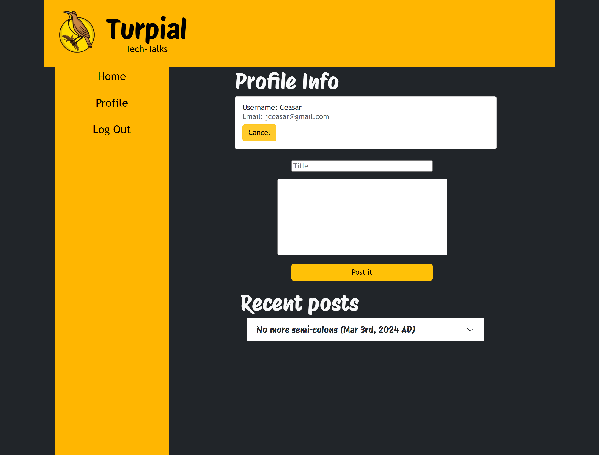

# Turpial Tech Talks

## Description

To test my understanding of the MVC architecture I put together a blogpost app where people can post and comment their thoughts on tech and coding and help with questions

## Table of Contents

- [Installation](#installation)
- [Usage](#usage)
- [Questions](#questions)
- [License](#license)
- [Deployment}(#deployment)

## Installation

the npm i command should take care of all the installation needed

## Usage

Upon loading the homepage will be rendered and you can see existing post and comments.

Clicking on the post will let you see the full post body and the comments on it.

To comment you'll have to log in, if you try to comment without being logged in you'll be redirected to the login page, alternatively you can click the login button on the sidebar.

After loggin in you can comment or access your profile page, on here you can create, update or delete your posts. 

 
 

Finally, after you are done, you can logout with the button on the sidebar, you'll be logged out after some time automatically too

## Tests

No tests provided at the moment

## Questions

For questions contact me at [Github](https://github.com/venecoderr) or [Email me](mailto:josefrm.55@gmail.com)

## License

This project is under the Unlicense license

## Deployment

https://turpial-tech-talks-51a893c3d6a6.herokuapp.com/
